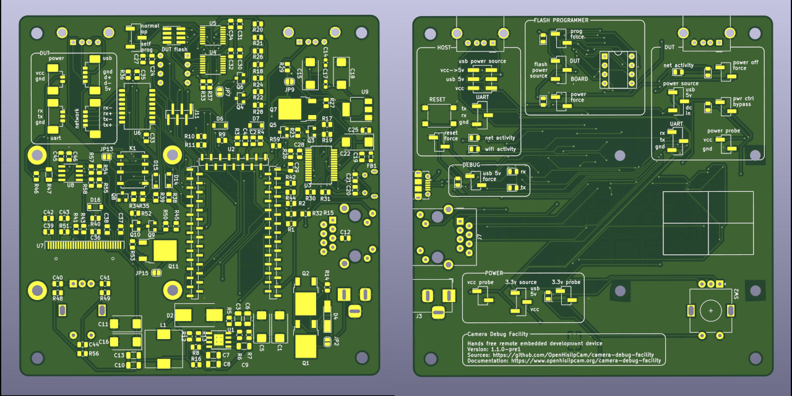
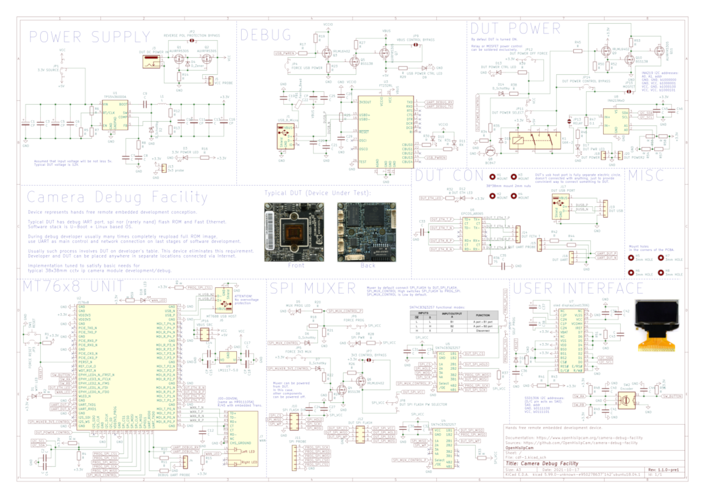

# camera-debug-facility

Hands free remote embedded development device.

End user documentation is hosted at https://www.openhisiipcam.org/camera-debug-facility.

## Overview schema

## Schematics

Can be found in `hardware/cdf-1`.

## Prototype

## Features

### Control interfaces
* FastEthernet
* WiFi (ap or client)
* http api
* uart via telnet
* uart via websockets
* spi flash programmer
* tftp server

### Dut control
* power via gpiod relay
* uart
* spi flash mem
* FastEthernet

## Implementation

### Proposed deploy schema

squashfs rootfs to ram
jffs2 user via overlay
