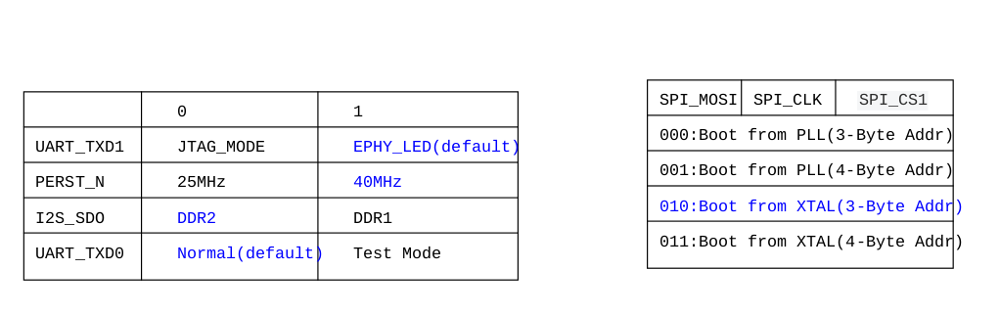

# Issues with 32MB (265Mbit) spi flashes

After some tests of skw92x and hlk-76x8x, there were found, 
that these modules setup mt76x8 to SPI-NOR 3-Byte Addr, same
time they install 32MB W25Q256.V spi flash.

After first power up W25Q256.V most probably will be in default factory
setup and accept 3 byte addresses, then U-Boot will be loaded, it will
detect that spi flash can run 4 byte addr mode and dynamicly send command
to change mode, after sw reset, as flash will not be reseted it will
keep 4 byte addr mode, cpu will try to load something via 3 byte and 
nothing will happens.

That obviously prevent device to be software reseted.

Solutions are:
* Use 16MB flash (sometimes not possible, as such module will come with low RAM amount)
* Tune module to use 4-Byte Addr.

## SPI-NOR 4-Byte Addr

Two things should be done: 
1. W25Q256.V should be setuped to use 4 byte addr mode by default
2. mt76x8 should be setuped to use 4 byte addr mode by default

## W25Q256.V

As main sw for spi nor flash operations is flashrom, it was sad, that 
last master version (by 9 oct 2021) doesn't include any issue related
features.

But PR https://github.com/flashrom/flashrom/pull/34 was found.
PR includes several modifications, but commit with needed funcs
was separated 
https://github.com/flashrom/flashrom/pull/34/commits/197c4965d11065b39efe96e191acc2b7ac3450de.
It can be found here `huming2207-flashrom-windond-adp.patch`.

As it was done to some previous flashrom version it is not possible to 
apply it to last master, so a bit modifications were done
`flashrom-7b9c74f-windond-adp.patch`.

New cmd options:
```console
./flashrom -p ch341a_spi --adp-status -V
./flashrom -p ch341a_spi --adp-enable -V
./flashrom -p ch341a_spi --adp-disable -V
```

Two W25Q256.V were tested, one sucessfully setuped, one not.
Why? This is question for further research.

## mt76x8 boot modes



SPI_CS1 should be pulled up to power (3.3V).
But it already pulled down somewhere on the module, so to make 
high level low value resistance should be added.
It works.

## Further research
Maybe it is also possible to patch U-Boot and Linux kernel to 
use W25Q256.V in 3 byte addr mode and use not more than 16MB space.
Such way makes possible to use modules out of the box without any hw 
modifications.
