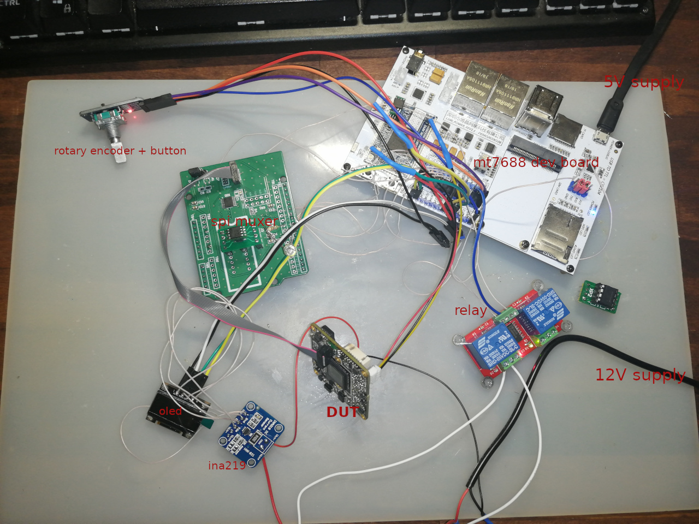

# Development notes, tests nad prototyping

After several experiments:
* [spi programmin via muxer](./speed/)
* [oled and VA meter](./i2c/)
* [user control via gpio](./gpio-input/)

Altogether were assembled in prototype.

## Notes
* R3, R4 from arudino muxed programmer board were removed, as IO11 on dev board already has 10K pullup.
