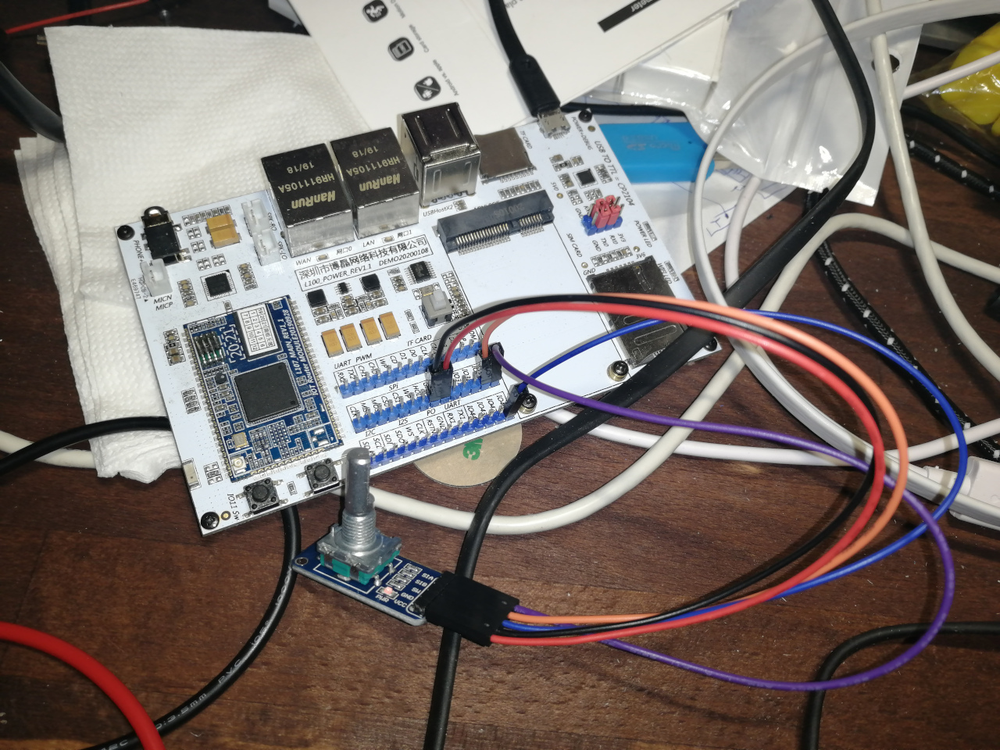

# Rotary encoder with button

Encoder and button were connected to ordinary gpio.
No deep digging was done about parameters and other tuning.
First attempt (mostly out of the box) was fine.



```
        rotary@0 {
                compatible = "rotary-encoder";
                gpios = <&gpio 39 0>, <&gpio 40 0>; /* GPIO19 is inverted */
                linux,axis = <1>; /* REL_X */
                rotary-encoder,encoding = "gray";
                rotary-encoder,relative-axis;
        };

        gpio-keys {
                compatible = "gpio-keys";
                autorepeat;

                left {
                        label = "GPIO Key UP";
                        linux,code = <69>; /* KEY_LEFT */
                        gpios = <&gpio 41 1>;
                };
        };
```

```console
# evtest 
No device specified, trying to scan all of /dev/input/event*
Available devices:
/dev/input/event0:	rotary@0
/dev/input/event1:	gpio-keys
Select the device event number [0-1]: 0
Input driver version is 1.0.1
Input device ID: bus 0x19 vendor 0x0 product 0x0 version 0x0
Input device name: "rotary@0"
Supported events:
  Event type 0 (EV_SYN)
  Event type 2 (EV_REL)
    Event code 1 (REL_Y)
Properties:
Testing ... (interrupt to exit)
Event: time 397.434583, type 2 (EV_REL), code 1 (REL_Y), value -1
Event: time 397.434583, -------------- SYN_REPORT ------------
Event: time 397.588939, type 2 (EV_REL), code 1 (REL_Y), value -1
Event: time 397.588939, -------------- SYN_REPORT ------------
Event: time 397.743230, type 2 (EV_REL), code 1 (REL_Y), value -1
Event: time 397.743230, -------------- SYN_REPORT ------------
Event: time 397.870931, type 2 (EV_REL), code 1 (REL_Y), value -1
Event: time 397.870931, -------------- SYN_REPORT ------------
Event: time 398.367746, type 2 (EV_REL), code 1 (REL_Y), value 1
Event: time 398.367746, -------------- SYN_REPORT ------------
```

```console
# evtest 
No device specified, trying to scan all of /dev/input/event*
Available devices:
/dev/input/event0:	rotary@0
/dev/input/event1:	gpio-keys
Select the device event number [0-1]: 1
Input driver version is 1.0.1
Input device ID: bus 0x19 vendor 0x1 product 0x1 version 0x100
Input device name: "gpio-keys"
Supported events:
  Event type 0 (EV_SYN)
  Event type 1 (EV_KEY)
    Event code 28 (KEY_ENTER)
Properties:
Testing ... (interrupt to exit)
Event: time 672.988025, type 1 (EV_KEY), code 28 (KEY_ENTER), value 1
Event: time 672.988025, -------------- SYN_REPORT ------------
Event: time 673.148034, type 1 (EV_KEY), code 28 (KEY_ENTER), value 0
Event: time 673.148034, -------------- SYN_REPORT ------------
Event: time 674.120034, type 1 (EV_KEY), code 28 (KEY_ENTER), value 1
Event: time 674.120034, -------------- SYN_REPORT ------------
Event: time 675.108034, type 1 (EV_KEY), code 28 (KEY_ENTER), value 0
Event: time 675.108034, -------------- SYN_REPORT ------------
```

*Events triggered on both leading and trailing edges of the signal.
During cursory examination there was not found wat to omit event with
value 0.*
