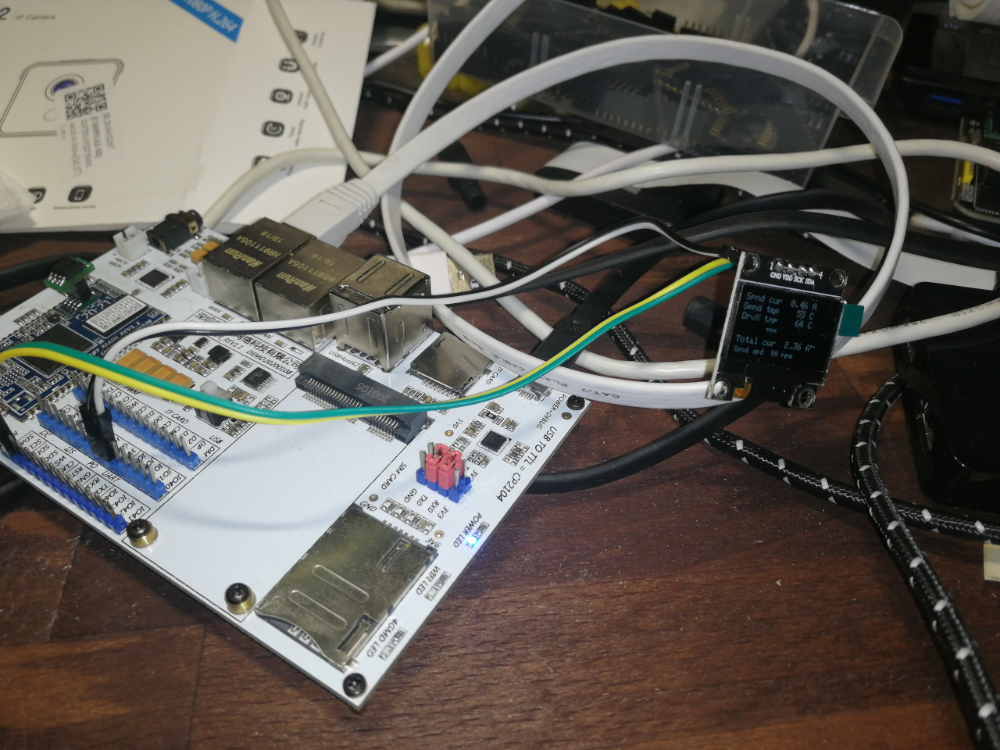
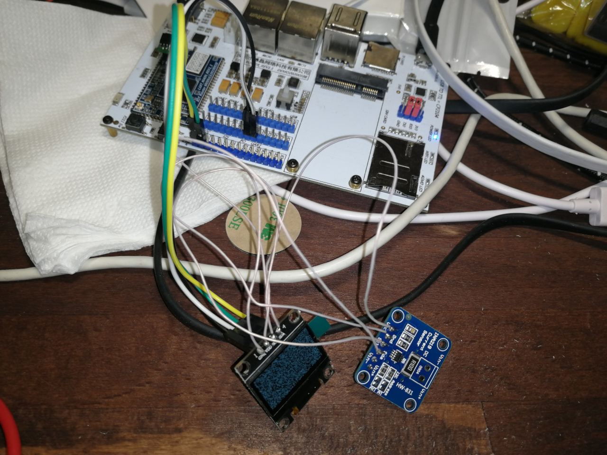

# I2C devices

I2C bus was tested on 100kHz, 400kHz, 800kHz, 2MHz and 3.5Mhz.
At least this value was setuped to dts and corresponding value 
was detected in kernel boot log:
```
[    0.551150] i2c-mt7621 10000900.i2c: clock 800 kHz
```
*Suspected that real speed is less than 3.5MHz, clock signal check required.*

## OLED SSD1306 (128x64) via I2C

### User space



Device can be operated from suer space via `/dev/i2c-0`.
Sample application `package/ssd1306-demo`.

### Framebuffer via Linux native driver

Also device can be added to dts and accessed via `/dev/fb0`.

```
&i2c {
        status = "okay";

        oled@3c {
                compatible = "solomon,ssd1306fb-i2c";
                reg = <0x3c>;
                solomon,width = <128>;
                solomon,height = <64>;
                solomon,page-offset = <0>;
                solomon,com-invdir = <1>;
        };
};
```

## INA219



Same time another one I2C slave device can be connected to the same bus:
```
&i2c {
        status = "okay";
        clock-frequency = <400000>;

        oled@3c {
                compatible = "solomon,ssd1306fb-i2c";
                reg = <0x3c>;
                solomon,width = <128>;
                solomon,height = <64>;
                solomon,page-offset = <0>;
                solomon,com-invdir = <1>;
        };

        ina219@40 {
                compatible = "ti,ina219";
                reg = <0x40>;
                shunt-resistor = <100000>;
        };
};
```

```console
# i2cdetect -y 0
     0  1  2  3  4  5  6  7  8  9  a  b  c  d  e  f
00:                         -- -- -- -- -- -- -- -- 
10: -- -- -- -- -- -- -- -- -- -- 1a -- -- -- -- -- 
20: -- -- -- -- -- -- -- -- -- -- -- -- -- -- -- -- 
30: -- -- -- -- -- -- -- -- -- -- -- -- UU -- -- -- 
40: UU -- -- -- -- -- -- -- -- -- -- -- -- -- -- -- 
50: -- -- -- -- -- -- -- -- -- -- -- -- -- -- -- -- 
60: -- -- -- -- -- -- -- -- -- -- -- -- -- -- -- -- 
70: -- -- -- -- -- -- -- --      
```
* *UU means that device is not accesible from user space, but handled by kernel module.*
* *0x1a is audio codec on dev board, that also connected to same I2C bus.*

```console
# cat /sys/class/hwmon/hwmon0/name 
ina219
# sensors 
ina219-i2c-0-40
Adapter: 10000900.i2c
in0:           0.00 V  
in1:         852.00 mV 
power1:        0.00 W  
curr1:       -1000.00 uA 
```
