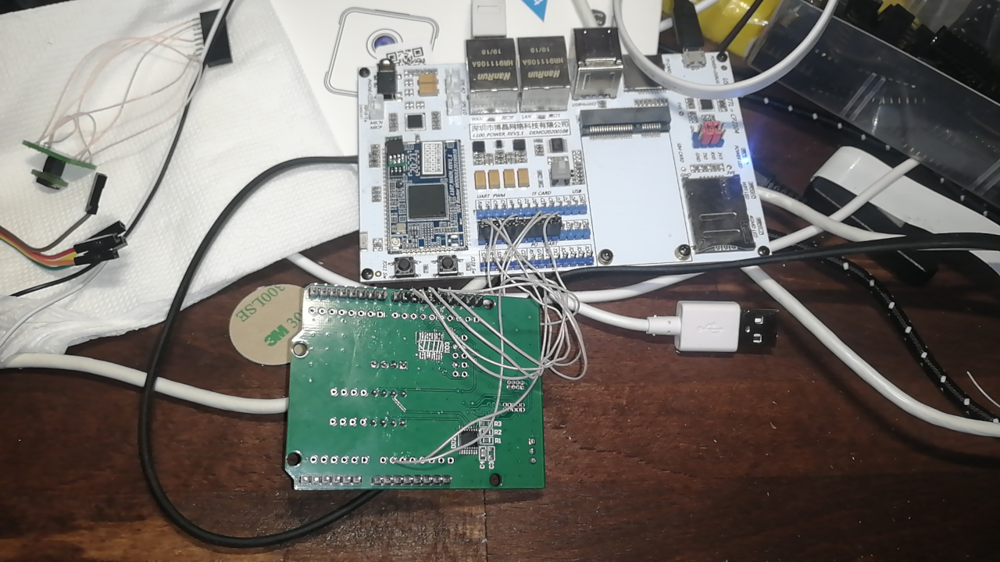
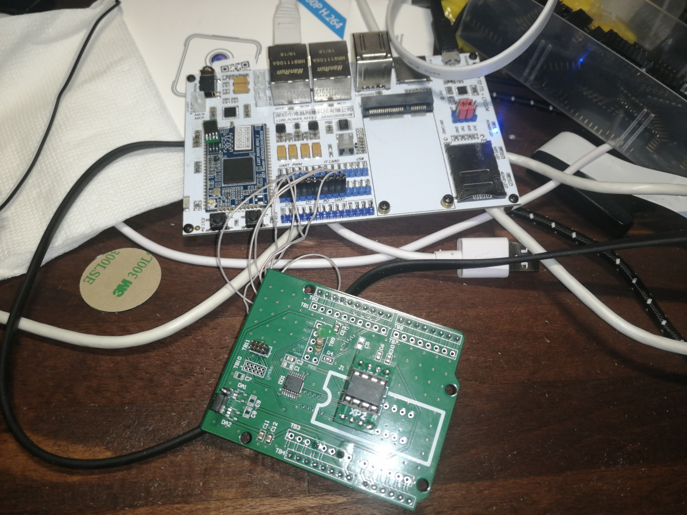
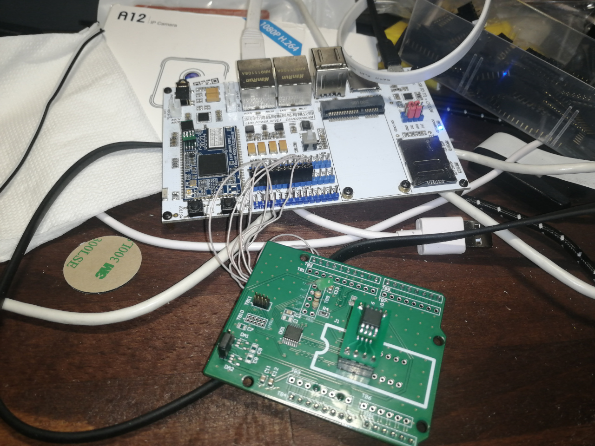
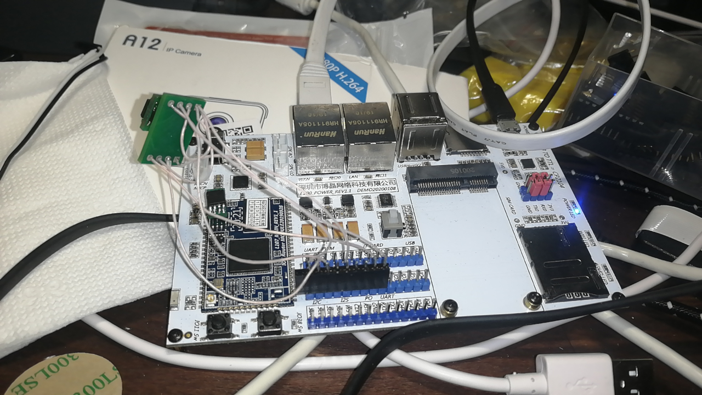
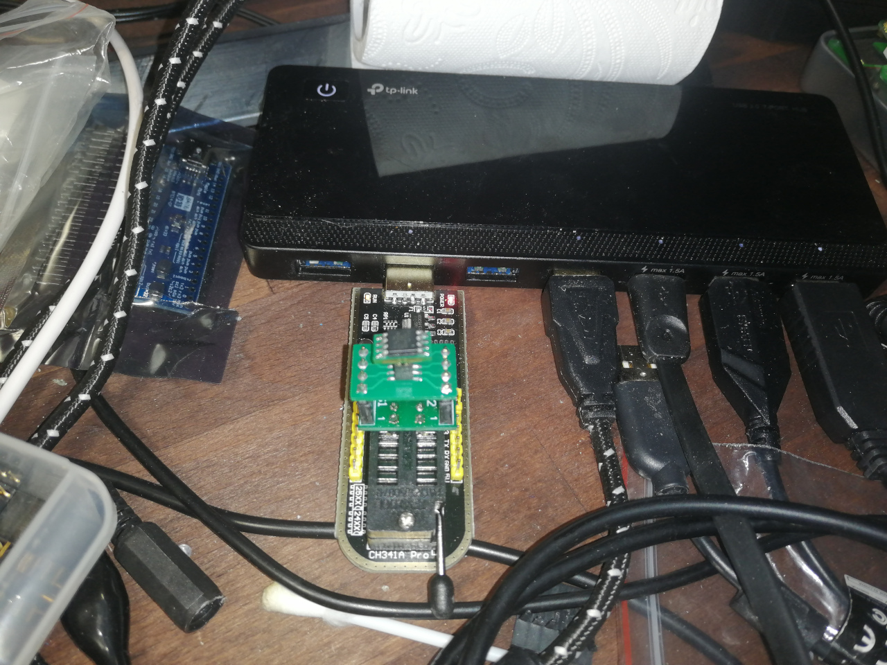

# SPI read speed measurements

In short: 35MHz read spead was achived via muxer based on SN74CB3Q3257PW ICs.
32MB read speed was a bit more than 10 seconds.

## Notes

[Arduino muxed programmer](../../hardware/arduino-muxed-programmer) PCBA were connected to MT7688 dev board.
74HC514 was removed (connections replaced with wires), as we actually
don't need here 5v to 3.3v convertion (as it was it's function) and
it was affecting MT7688's ROM boot (it also seat on same spi controller,
but with different CS).



SPI speed was limited via Linux's dts by 40MHz.
```
        spidev@1 {
                #address-cells = <1>;
                #size-cells = <1>;
                compatible = "linux,spidev";
                reg = <1>;
                spi-max-frequency = <40000000>;
        };
```

## MT7688 W25Q128.V 16MB DIP via muxer on wires



```console
# time flashrom --programmer linux_spi:dev=/dev/spidev0.1,spispeed=1000 -r /tmp/1
flashrom  on Linux 5.4.143 (mips)
flashrom is free software, get the source code at https://flashrom.org

Using clock_gettime for delay loops (clk_id: 1, resolution: 1ns).
Found Winbond flash chip "W25Q128.V" (16384 kB, SPI) on linux_spi.
Reading flash... done.
real	2m 16.50s
user	0m 0.01s
sys	2m 16.44s
# time flashrom --programmer linux_spi:dev=/dev/spidev0.1,spispeed=2000 -r /tmp/1
flashrom  on Linux 5.4.143 (mips)
flashrom is free software, get the source code at https://flashrom.org

Using clock_gettime for delay loops (clk_id: 1, resolution: 1ns).
Found Winbond flash chip "W25Q128.V" (16384 kB, SPI) on linux_spi.
Reading flash... done.
real	1m 9.03s
user	0m 0.05s
sys	1m 8.93s
# time flashrom --programmer linux_spi:dev=/dev/spidev0.1,spispeed=4000 -r /tmp/1
flashrom  on Linux 5.4.143 (mips)
flashrom is free software, get the source code at https://flashrom.org

Using clock_gettime for delay loops (clk_id: 1, resolution: 1ns).
Found Winbond flash chip "W25Q128.V" (16384 kB, SPI) on linux_spi.
Reading flash... done.
real	0m 35.58s
user	0m 0.02s
sys	0m 35.51s
# time flashrom --programmer linux_spi:dev=/dev/spidev0.1,spispeed=8000 -r /tmp/1
flashrom  on Linux 5.4.143 (mips)
flashrom is free software, get the source code at https://flashrom.org

Using clock_gettime for delay loops (clk_id: 1, resolution: 1ns).
Found Winbond flash chip "W25Q128.V" (16384 kB, SPI) on linux_spi.
Reading flash... done.
real	0m 19.50s
user	0m 0.01s
sys	0m 19.44s
# time flashrom --programmer linux_spi:dev=/dev/spidev0.1,spispeed=10000 -r /tmp/1
flashrom  on Linux 5.4.143 (mips)
flashrom is free software, get the source code at https://flashrom.org

Using clock_gettime for delay loops (clk_id: 1, resolution: 1ns).
Found Winbond flash chip "W25Q128.V" (16384 kB, SPI) on linux_spi.
Reading flash... done.
real	0m 15.92s
user	0m 0.00s
sys	0m 15.87s
# time flashrom --programmer linux_spi:dev=/dev/spidev0.1,spispeed=15000 -r /tmp/1
flashrom  on Linux 5.4.143 (mips)
flashrom is free software, get the source code at https://flashrom.org

Using clock_gettime for delay loops (clk_id: 1, resolution: 1ns).
Found Winbond flash chip "W25Q128.V" (16384 kB, SPI) on linux_spi.
Reading flash... done.
real	0m 11.10s
user	0m 0.01s
sys	0m 11.04s
# time flashrom --programmer linux_spi:dev=/dev/spidev0.1,spispeed=18000 -r /tmp/1
flashrom  on Linux 5.4.143 (mips)
flashrom is free software, get the source code at https://flashrom.org

Using clock_gettime for delay loops (clk_id: 1, resolution: 1ns).
Found Winbond flash chip "W25Q128.V" (16384 kB, SPI) on linux_spi.
Reading flash... done.
real	0m 9.30s
user	0m 0.03s
sys	0m 9.22s
# time flashrom --programmer linux_spi:dev=/dev/spidev0.1,spispeed=20000 -r /tmp/1
flashrom  on Linux 5.4.143 (mips)
flashrom is free software, get the source code at https://flashrom.org

Using clock_gettime for delay loops (clk_id: 1, resolution: 1ns).
Found Winbond flash chip "unknown Winbond (ex Nexcom) SPI chip" (0 kB, SPI) on linux_spi.
===
This flash part has status NOT WORKING for operations: PROBE READ ERASE WRITE
The test status of this chip may have been updated in the latest development
version of flashrom. If you are running the latest development version,
please email a report to flashrom@flashrom.org if any of the above operations
work correctly for you with this flash chip. Please include the flashrom log
file for all operations you tested (see the man page for details), and mention
which mainboard or programmer you tested in the subject line.
Thanks for your help!
Read is not working on this chip. Aborting.
Command exited with non-zero status 1
real	0m 0.11s
user	0m 0.01s
sys	0m 0.09s
# time flashrom --programmer linux_spi:dev=/dev/spidev0.1,spispeed=18000 -r /tmp/1
flashrom  on Linux 5.4.143 (mips)
flashrom is free software, get the source code at https://flashrom.org

Using clock_gettime for delay loops (clk_id: 1, resolution: 1ns).
Found Winbond flash chip "W25Q128.V" (16384 kB, SPI) on linux_spi.
Reading flash... done.
real	0m 9.30s
user	0m 0.02s
sys	0m 9.23s
```

## MT7688 MX25L25635F/MX25L25645G 32MB via muxer on wires



```console
# time flashrom --programmer linux_spi:dev=/dev/spidev0.1,spispeed=1000 -r /tmp/1
flashrom  on Linux 5.4.143 (mips)
flashrom is free software, get the source code at https://flashrom.org

Using clock_gettime for delay loops (clk_id: 1, resolution: 1ns).
Found Macronix flash chip "MX25L25635F/MX25L25645G" (32768 kB, SPI) on linux_spi.
Reading flash... done.
real	4m 32.96s
user	0m 0.01s
sys	4m 32.85s
# time flashrom --programmer linux_spi:dev=/dev/spidev0.1,spispeed=2000 -r /tmp/1
flashrom  on Linux 5.4.143 (mips)
flashrom is free software, get the source code at https://flashrom.org

Using clock_gettime for delay loops (clk_id: 1, resolution: 1ns).
Found Macronix flash chip "MX25L25635F/MX25L25645G" (32768 kB, SPI) on linux_spi.
Reading flash... done.
real	2m 18.07s
user	0m 0.01s
sys	2m 17.96s
# time flashrom --programmer linux_spi:dev=/dev/spidev0.1,spispeed=4000 -r /tmp/1
flashrom  on Linux 5.4.143 (mips)
flashrom is free software, get the source code at https://flashrom.org

Using clock_gettime for delay loops (clk_id: 1, resolution: 1ns).
Found Macronix flash chip "MX25L25635F/MX25L25645G" (32768 kB, SPI) on linux_spi.
Reading flash... done.
real	1m 11.06s
user	0m 0.04s
sys	1m 10.91s
# time flashrom --programmer linux_spi:dev=/dev/spidev0.1,spispeed=8000 -r /tmp/1
flashrom  on Linux 5.4.143 (mips)
flashrom is free software, get the source code at https://flashrom.org

Using clock_gettime for delay loops (clk_id: 1, resolution: 1ns).
Found Macronix flash chip "MX25L25635F/MX25L25645G" (32768 kB, SPI) on linux_spi.
Reading flash... done.
real	0m 38.89s
user	0m 0.05s
sys	0m 38.73s
# time flashrom --programmer linux_spi:dev=/dev/spidev0.1,spispeed=10000 -r /tmp/1
flashrom  on Linux 5.4.143 (mips)
flashrom is free software, get the source code at https://flashrom.org

Using clock_gettime for delay loops (clk_id: 1, resolution: 1ns).
Found Macronix flash chip "MX25L25635F/MX25L25645G" (32768 kB, SPI) on linux_spi.
Reading flash... done.
real	0m 31.68s
user	0m 0.03s
sys	0m 31.55s
# time flashrom --programmer linux_spi:dev=/dev/spidev0.1,spispeed=15000 -r /tmp/1
flashrom  on Linux 5.4.143 (mips)
flashrom is free software, get the source code at https://flashrom.org

Using clock_gettime for delay loops (clk_id: 1, resolution: 1ns).
Found Macronix flash chip "MX25L25635F/MX25L25645G" (32768 kB, SPI) on linux_spi.
Reading flash... done.
real	0m 22.10s
user	0m 0.01s
sys	0m 22.00s
# time flashrom --programmer linux_spi:dev=/dev/spidev0.1,spispeed=18000 -r /tmp/1
flashrom  on Linux 5.4.143 (mips)
flashrom is free software, get the source code at https://flashrom.org

Using clock_gettime for delay loops (clk_id: 1, resolution: 1ns).
Found Macronix flash chip "MX25L25635F/MX25L25645G" (32768 kB, SPI) on linux_spi.
Reading flash... done.
real	0m 18.49s
user	0m 0.06s
sys	0m 18.34s
# time flashrom --programmer linux_spi:dev=/dev/spidev0.1,spispeed=20000 -r /tmp/1
flashrom  on Linux 5.4.143 (mips)
flashrom is free software, get the source code at https://flashrom.org

Using clock_gettime for delay loops (clk_id: 1, resolution: 1ns).
Found Macronix flash chip "MX25L25635F/MX25L25645G" (32768 kB, SPI) on linux_spi.
Reading flash... done.
real	0m 17.27s
user	0m 0.03s
sys	0m 17.15s
# time flashrom --programmer linux_spi:dev=/dev/spidev0.1,spispeed=25000 -r /tmp/1
flashrom  on Linux 5.4.143 (mips)
flashrom is free software, get the source code at https://flashrom.org

Using clock_gettime for delay loops (clk_id: 1, resolution: 1ns).
Found Macronix flash chip "MX25L25635F/MX25L25645G" (32768 kB, SPI) on linux_spi.
Reading flash... done.
real	0m 14.87s
user	0m 0.03s
sys	0m 14.75s
# time flashrom --programmer linux_spi:dev=/dev/spidev0.1,spispeed=30000 -r /tmp/1
flashrom  on Linux 5.4.143 (mips)
flashrom is free software, get the source code at https://flashrom.org

Using clock_gettime for delay loops (clk_id: 1, resolution: 1ns).
Found Macronix flash chip "MX25L25635F/MX25L25645G" (32768 kB, SPI) on linux_spi.
Reading flash... done.
real	0m 13.66s
user	0m 0.04s
sys	0m 13.53s
# time flashrom --programmer linux_spi:dev=/dev/spidev0.1,spispeed=35000 -r /tmp/1
flashrom  on Linux 5.4.143 (mips)
flashrom is free software, get the source code at https://flashrom.org

Using clock_gettime for delay loops (clk_id: 1, resolution: 1ns).
Found Macronix flash chip "unknown Macronix SPI chip" (0 kB, SPI) on linux_spi.
===
This flash part has status NOT WORKING for operations: PROBE READ ERASE WRITE
The test status of this chip may have been updated in the latest development
version of flashrom. If you are running the latest development version,
please email a report to flashrom@flashrom.org if any of the above operations
work correctly for you with this flash chip. Please include the flashrom log
file for all operations you tested (see the man page for details), and mention
which mainboard or programmer you tested in the subject line.
Thanks for your help!
Read is not working on this chip. Aborting.
Command exited with non-zero status 1
real	0m 0.11s
user	0m 0.01s
sys	0m 0.09s
# time flashrom --programmer linux_spi:dev=/dev/spidev0.1,spispeed=30000 -r /tmp/1
flashrom  on Linux 5.4.143 (mips)
flashrom is free software, get the source code at https://flashrom.org

Using clock_gettime for delay loops (clk_id: 1, resolution: 1ns).
Found Macronix flash chip "MX25L25635F/MX25L25645G" (32768 kB, SPI) on linux_spi.
Reading flash... done.
real	0m 13.63s
user	0m 0.04s
sys	0m 13.51s
```

## MT7688 MX25L25635F/MX25L25645G 32MB on wires



```console
# time flashrom --programmer linux_spi:dev=/dev/spidev0.1,spispeed=1000 -r /tmp/1
flashrom  on Linux 5.4.143 (mips)
flashrom is free software, get the source code at https://flashrom.org

Using clock_gettime for delay loops (clk_id: 1, resolution: 1ns).
Found Macronix flash chip "MX25L25635F/MX25L25645G" (32768 kB, SPI) on linux_spi.
Reading flash... done.
real	4m 32.94s
user	0m 0.02s
sys	4m 32.82s
# time flashrom --programmer linux_spi:dev=/dev/spidev0.1,spispeed=2000 -r /tmp/1
flashrom  on Linux 5.4.143 (mips)
flashrom is free software, get the source code at https://flashrom.org

Using clock_gettime for delay loops (clk_id: 1, resolution: 1ns).
Found Macronix flash chip "MX25L25635F/MX25L25645G" (32768 kB, SPI) on linux_spi.
Reading flash... done.
real	2m 18.08s
user	0m 0.02s
sys	2m 17.96s
# time flashrom --programmer linux_spi:dev=/dev/spidev0.1,spispeed=4000 -r /tmp/1
flashrom  on Linux 5.4.143 (mips)
flashrom is free software, get the source code at https://flashrom.org

Using clock_gettime for delay loops (clk_id: 1, resolution: 1ns).
Found Macronix flash chip "MX25L25635F/MX25L25645G" (32768 kB, SPI) on linux_spi.
Reading flash... done.
real	1m 11.09s
user	0m 0.03s
sys	1m 10.96s
# time flashrom --programmer linux_spi:dev=/dev/spidev0.1,spispeed=8000 -r /tmp/1
flashrom  on Linux 5.4.143 (mips)
flashrom is free software, get the source code at https://flashrom.org

Using clock_gettime for delay loops (clk_id: 1, resolution: 1ns).
Found Macronix flash chip "MX25L25635F/MX25L25645G" (32768 kB, SPI) on linux_spi.
Reading flash... done.
real	0m 38.89s
user	0m 0.05s
sys	0m 38.75s
# time flashrom --programmer linux_spi:dev=/dev/spidev0.1,spispeed=10000 -r /tmp/1
flashrom  on Linux 5.4.143 (mips)
flashrom is free software, get the source code at https://flashrom.org

Using clock_gettime for delay loops (clk_id: 1, resolution: 1ns).
Found Macronix flash chip "MX25L25635F/MX25L25645G" (32768 kB, SPI) on linux_spi.
Reading flash... done.
real	0m 31.68s
user	0m 0.02s
sys	0m 31.56s
# time flashrom --programmer linux_spi:dev=/dev/spidev0.1,spispeed=15000 -r /tmp/1
flashrom  on Linux 5.4.143 (mips)
flashrom is free software, get the source code at https://flashrom.org

Using clock_gettime for delay loops (clk_id: 1, resolution: 1ns).
Found Macronix flash chip "MX25L25635F/MX25L25645G" (32768 kB, SPI) on linux_spi.
Reading flash... done.
real	0m 22.11s
user	0m 0.06s
sys	0m 21.96s
# time flashrom --programmer linux_spi:dev=/dev/spidev0.1,spispeed=18000 -r /tmp/1
flashrom  on Linux 5.4.143 (mips)
flashrom is free software, get the source code at https://flashrom.org

Using clock_gettime for delay loops (clk_id: 1, resolution: 1ns).
Found Macronix flash chip "MX25L25635F/MX25L25645G" (32768 kB, SPI) on linux_spi.
Reading flash... done.
real	0m 18.51s
user	0m 0.02s
sys	0m 18.40s
# time flashrom --programmer linux_spi:dev=/dev/spidev0.1,spispeed=20000 -r /tmp/1
flashrom  on Linux 5.4.143 (mips)
flashrom is free software, get the source code at https://flashrom.org

Using clock_gettime for delay loops (clk_id: 1, resolution: 1ns).
Found Macronix flash chip "MX25L25635F/MX25L25645G" (32768 kB, SPI) on linux_spi.
Reading flash... done.
real	0m 17.27s
user	0m 0.02s
sys	0m 17.17s
# time flashrom --programmer linux_spi:dev=/dev/spidev0.1,spispeed=25000 -r /tmp/1
flashrom  on Linux 5.4.143 (mips)
flashrom is free software, get the source code at https://flashrom.org

Using clock_gettime for delay loops (clk_id: 1, resolution: 1ns).
Found Macronix flash chip "MX25L25635F/MX25L25645G" (32768 kB, SPI) on linux_spi.
Reading flash... done.
real	0m 14.87s
user	0m 0.06s
sys	0m 14.72s
# time flashrom --programmer linux_spi:dev=/dev/spidev0.1,spispeed=30000 -r /tmp/1
flashrom  on Linux 5.4.143 (mips)
flashrom is free software, get the source code at https://flashrom.org

Using clock_gettime for delay loops (clk_id: 1, resolution: 1ns).
Found Macronix flash chip "MX25L25635F/MX25L25645G" (32768 kB, SPI) on linux_spi.
Reading flash... done.
real	0m 13.63s
user	0m 0.02s
sys	0m 13.52s
# time flashrom --programmer linux_spi:dev=/dev/spidev0.1,spispeed=35000 -r /tmp/1
flashrom  on Linux 5.4.143 (mips)
flashrom is free software, get the source code at https://flashrom.org

Using clock_gettime for delay loops (clk_id: 1, resolution: 1ns).
Found Macronix flash chip "MX25L25635F/MX25L25645G" (32768 kB, SPI) on linux_spi.
Reading flash... done.
real	0m 11.26s
user	0m 0.03s
sys	0m 11.15s
# time flashrom --programmer linux_spi:dev=/dev/spidev0.1,spispeed=40000 -r /tmp/1
flashrom  on Linux 5.4.143 (mips)
flashrom is free software, get the source code at https://flashrom.org

Using clock_gettime for delay loops (clk_id: 1, resolution: 1ns).
Found Macronix flash chip "MX25L25635F/MX25L25645G" (32768 kB, SPI) on linux_spi.
Reading flash... done.
real	0m 10.03s
user	0m 0.05s
sys	0m 9.90s
```

## CH341 MX25L25635F/MX25L25645G 32MB on socket



From flashrom man page:
```
ch341a_spi programmer
The WCH CH341A programmer does not support any parameters currently. SPI frequency is fixed at 2 MHz, and CS0 is used as per the device.
```

```console
$ sudo time vendors/flashrom/flashrom --programmer ch341a_spi -r /tmp/1
flashrom  on Linux 4.18.0-25-generic (x86_64)
flashrom is free software, get the source code at https://flashrom.org

Using clock_gettime for delay loops (clk_id: 1, resolution: 1ns).
Found Macronix flash chip "MX25L25635F/MX25L25645G" (32768 kB, SPI) on ch341a_spi.
Reading flash... done.
9.62user 15.29system 4:31.08elapsed 9%CPU (0avgtext+0avgdata 36092maxresident)k
0inputs+65536outputs (0major+8447minor)pagefaults 0swaps
```

## Attempt to get more

Linux dts was changed to allow up to 100MHz spi speed.
32MB flash was tested connected directly (without muxer). 
Seems ~45MHz is max speed, that can be achived 
(at least with connection via wires).

```console
# time flashrom --programmer linux_spi:dev=/dev/spidev0.1,spispeed=45000 -r /tmp/1
flashrom  on Linux 5.4.143 (mips)
flashrom is free software, get the source code at https://flashrom.org

Using clock_gettime for delay loops (clk_id: 1, resolution: 1ns).
Found Macronix flash chip "MX25L25635F/MX25L25645G" (32768 kB, SPI) on linux_spi.
Reading flash... done.
real	0m 10.05s
user	0m 0.03s
sys	0m 9.94s
# time flashrom --programmer linux_spi:dev=/dev/spidev0.1,spispeed=45000 -v /tmp/1
flashrom  on Linux 5.4.143 (mips)
flashrom is free software, get the source code at https://flashrom.org

Using clock_gettime for delay loops (clk_id: 1, resolution: 1ns).
Found Macronix flash chip "MX25L25635F/MX25L25645G" (32768 kB, SPI) on linux_spi.
Verifying flash... VERIFIED.
real	0m 10.90s
user	0m 0.89s
sys	0m 9.93s
# time flashrom --programmer linux_spi:dev=/dev/spidev0.1,spispeed=47000 -v /tmp/1
flashrom  on Linux 5.4.143 (mips)
flashrom is free software, get the source code at https://flashrom.org

Using clock_gettime for delay loops (clk_id: 1, resolution: 1ns).
Found Macronix flash chip "MX25L25635F/MX25L25645G" (32768 kB, SPI) on linux_spi.
Verifying flash... VERIFIED.
real	0m 10.88s
user	0m 0.89s
sys	0m 9.91s
# time flashrom --programmer linux_spi:dev=/dev/spidev0.1,spispeed=48000 -v /tmp/1
flashrom  on Linux 5.4.143 (mips)
flashrom is free software, get the source code at https://flashrom.org

Using clock_gettime for delay loops (clk_id: 1, resolution: 1ns).
Found Macronix flash chip "MX25L25635F/MX25L25645G" (32768 kB, SPI) on linux_spi.
Verifying flash... VERIFIED.
real	0m 10.87s
user	0m 0.87s
sys	0m 9.92s
# time flashrom --programmer linux_spi:dev=/dev/spidev0.1,spispeed=49000 -v /tmp/1
flashrom  on Linux 5.4.143 (mips)
flashrom is free software, get the source code at https://flashrom.org

Using clock_gettime for delay loops (clk_id: 1, resolution: 1ns).
Found Macronix flash chip "MX25L25635F/MX25L25645G" (32768 kB, SPI) on linux_spi.
Verifying flash... FAILED at 0x0000030b! Expected=0x24, Found=0x34, failed byte count from 0x00000000-0x01ffffff: 0x325e
Command exited with non-zero status 3
real	0m 9.67s
user	0m 0.90s
sys	0m 8.69s
```
